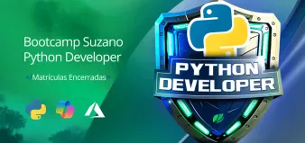

# 🐍 Bootcamp Suzano - Desenvolvedor Python

## 🎯 Sobre o Bootcamp

Este bootcamp gratuito é o ponto de partida ideal para quem quer dominar **Python**, uma das linguagens mais requisitadas do mercado. Ao longo da jornada, você irá construir **8 desafios de projeto**, aprenderá a utilizar **IA com Microsoft Copilot e Azure**, e se destacará com habilidades muito procuradas por recrutadores.

### ✨ Destaques do Programa

- 👩‍💻 Trilhas práticas para desenvolver habilidades em Python  
- 🤖 Aplicações reais com Microsoft Copilot Studio e Azure AI  
- 🧠 Fundamentos de IA, POO, Git e projetos colaborativos  
- 📈 Acesso a ranking com premiações e reconhecimento  
- 🎓 Certificados para cada curso e projeto finalizado  
- 💼 Portfólio com projetos completos para destacar sua carreira  

## 🛠️ Estrutura do Bootcamp

### 📌 Atividades Principais

1. **Mentorias (Ao Vivo)** 🎥  
   - Interações com profissionais da Suzano  
   - Sessões de perguntas e respostas sobre carreira e tecnologia  

2. **Desafios de Código** 💻  
   - Testes práticos para consolidar seu aprendizado  
   - Foco em lógica e pensamento computacional  

3. **Desafios de Projeto** 🏗️  
   - Projetos práticos e aplicáveis no mercado  
   - Destaque no portfólio e GitHub  

4. **Ranking e Premiações** 🏆  
   - Ganhe pontos por interações, quizzes e qualidade de código  

## 🗓️ Informações Importantes

- ✅ Bootcamp totalmente gratuito  
- 📘 Conteúdo completo para quem busca dominar Python e IA aplicada  
- 📈 Ganhe destaque com projetos reais e certificados  

## 📂 Índice de Projetos e Desafios

### 🧪 Projetos Práticos

- [**Contribuindo em um Projeto Open Source no GitHub**](https://github.com/Jcnok/dio-lab-open-source/tree/feat/community/Jcnok)
- [**Sistema Bancário com Python**](https://github.com/Jcnok/Potencia_Tech_powered_by_iFood-Ciencias_de_Dados_com_Python/tree/main/DP2#desafio---criando-um-sistema-banc%C3%A1rio-simples)  
- [**Otimizando o Sistema Bancário com Funções Python**](https://github.com/Jcnok/Potencia_Tech_powered_by_iFood-Ciencias_de_Dados_com_Python/tree/main/DP3#desafio---otimizando-o-sistema-banc%C3%A1rio)  
- [**Modelando o Sistema Bancário em POO com Python**](https://github.com/Jcnok/NTT-Data-Engenharia_de_Dados_com_Python/tree/master/desafios_de_projeto/desafio4#resolu%C3%A7%C3%A3o-2---c%C3%B3digo-baseado-em-poo)
- [**Criando um Pacote de Processamento de Imagens com Python**](Em construção)  
- [**Criação de Copilotos no Microsoft Copilot Studio**](https://github.com/Jcnok/Suzano-Desenvolvedor-Python/tree/master/desafio_1#desafio-microsoft-copilot-studio-criando-meu-primeiro-copiloto-)  
- [**Criando um Copiloto com Fluxo de Conversa Personalizado no Microsoft Copilot Studio**](Em construção)
- [**Análise de Sentimentos com Language Studio no Azure AI**](Em construção)  

## 🏁 Conclusão e Opinião Pessoal

Participar do bootcamp **Suzano - Desenvolvedor Python** foi uma jornada de aprendizado prática e completa. Desenvolvi habilidades essenciais, desde a sintaxe básica até o uso de IA generativa e copilotos(Agentes) personalizados.

---

## 📫 Contatos e Redes Sociais

Vamos nos conectar? 🤝

### 🎯 Habilidades em Desenvolvimento

  
  
  

---
